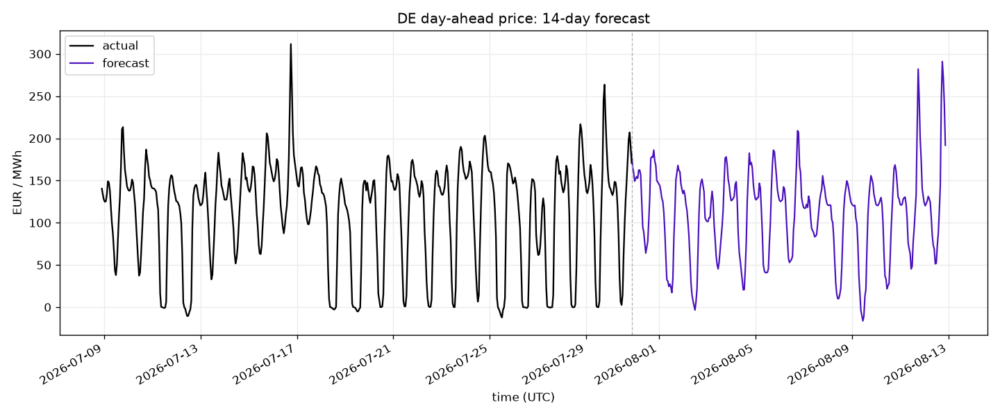

# eex-price-forecast

Short-term **day-ahead electricity price forecasting for Germany** (the EEX / EPEX SPOT DE-LU bidding
zone), covering up to 14 unknown German delivery days after the latest published price. It finds the
weather grid points that best explain German wind, solar, and load, forecasts those fundamentals, and
turns them — together with the cross-border drivers that move a coupled market — into a price.



> *Example run (`eex forecast --plot`); the committed image is a static snapshot and will lag the code.*

> Implemented end to end: weather-point search (including cross-border neighbour wind), the ENTSO-E /
> Open-Meteo backfills, the four-model forecast, Optuna walk-forward tuning, and the 14-day forecast
> pipeline. Remaining refinements are in [Development ideas](#development-ideas).

## What it does

1. **Weather-point search.** Generates candidate coordinates across Germany — offshore North Sea /
   Baltic points for wind, a separate land-only set for temperature and solar — ranks them by lagged
   correlation against actual German wind / load / solar, and keeps the best. The wind search also
   reaches **across the border**, ranking each interconnected neighbour's wind points against **German
   price** (see [Neighbour wind](#neighbour-wind)).
2. **Backfill into SQLite.** DE day-ahead prices and wind / solar / load actuals from ENTSO-E; hourly
   weather (100 m wind, 2 m temperature, shortwave radiation) from Open-Meteo at the chosen points; and
   the known-ahead cross-border drivers (French nuclear availability, interconnector transfer capacity).
3. **Two-stage forecast.** Three XGBoost **generation sub-models** forecast wind, solar, and load from
   the weather; the **price model** then forecasts the day-ahead price from those fundamentals plus
   calendar, the weekly price lag, weather aggregates, and the cross-border drivers. Wind and solar are
   learned as a fraction of **installed capacity** (from ENTSO-E) so they stay calibrated as the fleet
   grows. Solar irradiance is summarized across the selected points by mean/sum/std/min/max, with a
   physical zero-generation constraint when every point is dark. Fitting uses **early stopping** with
   residual **diagnostics** (Durbin-Watson, ACF); hyperparameters are **Optuna**-tuned by walk-forward
   backtest.

Actuals and forecasts are stored in **separate columns** for every series, so predictions never
overwrite measured values.

All timestamps are stored in **UTC**, while calendar features are derived in the German market timezone
(`Europe/Berlin`). This keeps hour, weekday, weekend, month, and public-holiday features aligned with
German civil time across local-midnight and DST boundaries.

## Architecture

```
src/eex_forecast/
  config.py            # typed settings (env), paths, DE constants, 14-day horizon
  db/                  # SQLite schema (separate actual/forecast columns) + upsert/query
  sources/entsoe.py    # DE price + wind/solar generation + load actuals + installed capacity (entsoe-py)
  sources/nuclear.py   # cross-border nuclear availability (installed capacity - A80/B14 outages)
  sources/ntc.py       # per-border transfer capacity (NTC): week-ahead over month-ahead, import + export
  weather/
    geometry.py        # download GISCO land + Marine-Regions EEZ GeoJSON
    candidates.py      # candidate points: land+sea ("zones") | land-only; point-in-ring + spread
    openmeteo.py       # Open-Meteo client (archived ECMWF forecasts + live forecast)
    point_search.py    # rank candidates by best lagged Pearson vs a target (DE actuals; DE price for neighbours)
  analysis/            # correlation matrix + candidate/ranked point map
  backfill.py          # orchestrate ENTSO-E + weather backfills
  features.py          # calendar, price lag, weather aggregates, per-model feature builders
  model.py             # XGBoost registry (wind/solar/load/price): capacity scaling, early stopping, diagnostics
  backtest_cutoffs.py  # the frozen backtest cutoffs (config/backtest_cutoffs.yaml) + DST window helpers
  tuning.py            # Optuna walk-forward hyperparameter tuning (shared backtest engine)
  aggregation.py       # A/B feature-aggregation strategies (eex analyze aggregation)
  ablation.py          # remove features and measure the loss (eex analyze ablation)
  evaluation.py        # end-to-end eval + oracle-substitution price diagnostics
  forecast.py          # the forecast pipeline (weather -> sub-models -> price -> CSV/plot)
  cli.py               # `eex` command-line interface
```

The geometry / candidate logic is pure Python (point-in-ring) — **no GIS/shapely dependency**. The
price model consumes the sub-models' forecasts as its fundamentals, so the chain runs
weather → wind/solar/load → price.

### When fundamentals are actuals versus forecasts

Historical wind, solar, and load actuals have two legitimate roles: they are the MW targets that train
and score their respective sub-models, and they are the clean historical fundamental inputs used to train
the price model. At live inference those future actuals do not exist, so the price model receives the three
sub-model forecasts through the actual-or-forecast coalesce in `features.fundamentals`.

The backtest tools preserve that distinction:

- tuning, aggregation, and ablation score one selected model; when that model is price, its historical
  test rows contain actual fundamentals, so the result is conditional price-model skill;
- `eex analyze eval` hides held-out fundamental actuals and runs all three sub-models first, so its price
  MAE is the end-to-end production-like score;
- `eex analyze oracle` deliberately switches between actual and forecast fundamentals in matched scenarios
  to measure each sub-model's downstream price effect. `all_actual` is diagnostic only; `forecast_all`
  reproduces the headline eval scenario.

## Quickstart

### Install

Requires **Python 3.11+**. From the project root:

```bash
python -m venv .venv
```

Activate it — pick the line for your shell:

| Shell | Activate |
|---|---|
| Windows · cmd.exe | `.venv\Scripts\activate` |
| Windows · PowerShell | `.venv\Scripts\Activate.ps1` |
| macOS / Linux · bash, zsh | `source .venv/bin/activate` |

Then install the package (with dev tools) and create your local env file:

```bash
pip install -e ".[dev]"          # runtime deps (xgboost, optuna, entsoe-py, ...) + test/lint tools
copy .env.example .env.local     # Windows  (cp on macOS / Linux)
```

Open `.env.local` and set your `ENTSO_E_API_KEY` (from the ENTSO-E Transparency Platform). With the venv
active, the `eex` command is on your PATH; every command below is identical across shells.

### Minimum setup for a forecast

The repository already includes the selected weather anchors in `config/weather_points.json` and tuned
model parameters in `config/hyperparams.json`. To use those committed choices, you can skip geometry,
candidate generation, point ranking, and hyperparameter tuning. Starting with an empty database, the
minimum path is:

```bash
eex db init
eex backfill entsoe --start 2023-01-01      # targets, actuals, and installed capacity
eex backfill weather --start 2023-01-01     # history at the committed weather points
eex backfill nuclear --start 2023-01-01     # French nuclear availability
eex backfill ntc --start 2023-01-01         # cross-border transfer capacity
eex model train                             # train all four models with committed hyperparameters
eex forecast --plot                         # first forecast -> data/forecast/
```

These commands still fetch the underlying history locally; the database and trained model artifacts are
runtime files and are not committed.

### Full first-time setup and experimentation

Building from empty is an ordered sequence — each step feeds the next:

```bash
eex db init                                 # create the SQLite database
eex geo download                            # one-time geometry download (land + land+sea GeoJSON)

eex points build --mode zones               # German wind candidates (land + sea)
eex points build --mode land                # German temperature / solar candidates (land only)
eex backfill entsoe --start 2023-01-01      # DE price + wind/solar/load actuals + installed capacity
# Ranking accepts either --year YYYY or both --start YYYY-MM-DD --end YYYY-MM-DD.
eex points rank --target wind --year 2025   # choose the best German points vs each actual (writes config)
eex points rank --target temp --year 2025
eex points rank --target solar --year 2025

eex points neighbours build                 # build cross-border wind candidates
eex points neighbours rank --year 2025

eex backfill weather --start 2023-01-01     # weather history at every chosen point (German + neighbour)
eex backfill nuclear --start 2023-01-01     # cross-border (French) nuclear availability
eex backfill ntc --start 2023-01-01         # per-border transfer capacity / NTC

eex model tune --target price               # optional but recommended (also wind / solar / load)
eex model train                             # train all four models
eex forecast --plot                         # first 14-day forecast -> data/forecast/
```

This full path is the experimentation surface rather than a mandatory prerequisite. You can generate
different candidate grids, choose another ranking year or explicit `--start`/`--end` window, retain a
different number of points with `--count`, compare weather-aggregation strategies, run feature
ablations, and tune each model independently. The committed point selection and hyperparameters are a
reproducible starting point, not restrictions on rebuilding the forecast around your own data window
and modelling choices.

### The daily loop

Once the database and models exist, the whole pipeline is one command:

```bash
eex run --train --plot                      # refresh recent data, retrain, then write a fresh 14-day forecast
```

`eex run` re-fetches the trailing ~14 days of actuals + weather; `--train` retrains the four models on
the refreshed history so they track the latest data; and it writes the forecast — all in one step.
Retraining is cheap (a couple of minutes) and keeps the models current, so it is the sensible daily
default; drop `--train` for a faster forecast-only run when the models are already fresh. The individual
steps are also available alone: `eex update` (data refresh only, `--days` to widen the window) and
`eex forecast --plot` (forecast only). Re-fetching a couple of weeks is enough to pick up newly-published
and revised ENTSO-E actuals; the known-ahead nuclear/NTC series cover history *and* horizon, so the
forecast step fetches those once over both windows rather than `update` re-pulling them.

> **After any feature-set change, retrain once** (`eex model train` or `eex run --train`). Prediction
> reindexes to the feature order the model was trained on, so serving a stale model against a changed
> feature set silently degrades it.

### What the forecast contains

`forecast` fetches the Open-Meteo weather forecast (and the known-ahead nuclear/NTC series over the
recent + horizon window), runs the sub-models to fill the fundamentals, then the price model, and writes
`data/forecast/forecast.csv` — the actual price alongside all four forecast series. `--plot` adds three
PNGs: `forecast.png` (actual price up to the last settled hour, then only the genuinely out-of-sample
forecast), `fundamentals.png` (the sub-model forecasts), and `drivers.png` (a panel per price-model
driver group — wind speed, irradiance, temperature, neighbour wind, nuclear, transfer capacity — over
the window, weekends/holidays shaded and split at *now*). `--write-db` also stores the forecast.

The models predict the **whole read window** while history supplies lag features and plotting context,
but the price plot deliberately hides the in-sample fitted values. The forward window begins one hour
after the latest published day-ahead price and targets the next **14 German delivery days**: before
tomorrow's prices publish it begins at D+1; afterward it shifts to D+2. If ECMWF weather stops during
the final delivery day, that incomplete day is dropped rather than publishing predictions from missing
weather. The command summary reports statistics over this genuinely out-of-sample tail only.

### Quick inspection

At any point after the backfills — these write to `data/analysis/`:

```bash
eex points map                              # German candidates + ranked points -> candidate_map.png
eex points neighbours map                   # neighbour candidates + selection -> candidate_map_neighbours.png
eex analyze correlation                     # feature <-> price correlation matrix -> correlation.csv + .png
```

`points map` is a sanity check that the search reached offshore for wind and spread the points sensibly.
`analyze correlation` shows how each driver correlates with the day-ahead price — a quick way to see,
e.g., that Dutch and Danish wind track the German price about as strongly as German wind does.

## Cross-border drivers

Germany does not price in isolation — it sits at the centre of the Central-Western European grid. Three
drivers carry that coupling into the model. Two of them (nuclear, NTC) are **known-ahead**: they publish
real values across the whole 14-day horizon, a rare luxury next to a decaying weather forecast.

### Neighbour wind

Abundant wind in a neighbouring bidding zone depresses **that** zone's price and, through imports,
Germany's. A model that only sees German weather misses this, so the wind search is extended across the
border. For each wind-relevant neighbour — **DK, NL, PL, FR, CH, CZ, AT** — the same machinery builds
land+sea candidate points inside that country and ranks them **against German price** (not any German
generation series) over wind speed and its cube (wind power scales with ~v³). The coupling is negative,
so candidates are ranked by correlation *magnitude*, and the **two most spatially-distinct points per
country** (≥ 50 km apart) are kept.

```bash
eex points neighbours build                 # land+sea wind candidates inside each neighbour
eex points neighbours rank --year 2025      # rank each neighbour's candidates vs DE price -> config
eex points neighbours map                   # plot candidates + selection
```

`rank` reads the German price already in the database, so run it **after** `backfill entsoe`. Candidates
are clipped to each country's own territory (excluding far-flung EEZ waters the source data mis-attributes,
e.g. the Faroese North Atlantic) so the chosen points sit in the wind regions that actually couple to
Germany. Points land in `config/weather_points.json` under a `neighbour_wind` role with stable columns
`ws_dk01`, `ws_nl01`, … (wind speed only — no auxiliary temperature, since these are a bare price proxy,
not a sub-model input). The next `eex backfill weather` picks them up automatically (or fetch just these
with `--role neighbour_wind`). In the price model each neighbour contributes a single **per-country
mean** (`nbr_wind_dk`, …) — chosen empirically by `eex analyze aggregation neighbour`: neighbour wind
cut price walk-forward MAE by **~1.4 EUR/MWh (~7.5%)**, and the per-country mean beat both a single
global index and the raw per-point columns.

### Nuclear availability

Germany closed its own reactors in **April 2023**, so nuclear reaches the German price only through
imports — chiefly from **France**, whose ~61 GW fleet is Europe's largest and whose outages swing the
Central-Western European supply balance. `eex backfill nuclear` derives the **available** capacity per
zone into one column:

```
nuclear_available_mw = installed_nuclear_capacity − Σ(unavailable from outages)
```

Unavailability comes from ENTSO-E [*Unavailability of Generation & Production Units* [15.1.A-D]](https://transparencyplatform.zendesk.com/hc/en-us/articles/16652173943828-Planned-Unavailability-Changes-in-Actual-Availability-of-Generation-Production-Units-15-1-A-15-1-B-15-1-C-15-1-D)
(documentType A80, psrType B14), via entsoe-py: each outage carries the unit's installed capacity and an
available-capacity step profile, so per unit `unavailable = nominal − available`, summed over the zone.
Installed capacity is the yearly [*Installed Generation Capacity Aggregated* [14.1.A]](https://transparencyplatform.zendesk.com/hc/en-us/articles/16648300912916-Installed-Generation-Capacity-Aggregated-14-1-A)
figure (A68), forward-filled. Zones are configurable (`NUCLEAR_ZONES`, France today; extensible to BE/CZ).

```bash
eex backfill nuclear --start 2023-01-01     # history; --end reaches D+2 by default
```

The key property: **planned outages publish years ahead**, so this column carries *real* availability
across the whole horizon rather than a prediction. The forecast step refetches it automatically, and it
enters the price model as a single `nuclear_available_mw` feature.

### Transfer capacity (NTC)

The interconnectors cap how much power can actually flow between Germany and each neighbour, so they set
**how tightly the zones couple**: ample capacity pulls prices together, while a reduced border (a line on
maintenance or outage) lets a zone decouple and its price run away. The drivers above only reach the
German price *to the extent the wires can carry them* — NTC is the valve.

```bash
eex backfill ntc --start 2023-01-01         # per-border NTC (week-ahead over month-ahead), import + export
```

`eex backfill ntc` fetches forecasted NTC [11.1] for each of DE's borders (AT, BE, CZ, DK1, DK2, FR, NL,
NO2, SE4) in both directions and stores per-border columns `ntc_imp_<b>` (into DE) and `ntc_exp_<b>` (out
of DE). It **blends two horizons per day**: [*Forecasted Week-ahead Transfer Capacities* [11.1]](https://transparencyplatform.zendesk.com/hc/en-us/articles/16647273283476-Forecasted-Week-ahead-Transfer-Capacities-11-1)
(the more refined revision, ~1 week out) where published, falling back to [*Forecasted Month-ahead
Transfer Capacities* [11.1]](https://transparencyplatform.zendesk.com/hc/en-us/articles/16647321153428-Forecasted-Month-ahead-Transfer-Capacities-11-1)
(coarser, but spanning the whole month) for the far horizon week-ahead has not reached — so a forecast's
near ~week gets the sharper level and its second week gets month-ahead. Both publish ahead, so this is
real across the horizon (refetched automatically).
The price model reads the two **totals** (`ntc_imp_total`, `ntc_exp_total`) — the low-dimensional "how
coupled is DE right now" signal — keeping the per-border detail in the database for analysis.

## Evaluating and tuning

Four tools — tuning, aggregation, ablation, and eval — follow the same **walk-forward backtest**
design: at each of a fixed set of cutoffs (see below) they train on everything before it and score MAE/RMSE
over the delivery-day window from it. Tuning, aggregation, and ablation share the single-model engine in
`tuning`; eval runs the complete dependency chain so wind, solar, and load are forecast before price. The
backtests reproduce the price model's serve-time weekly-lag availability, so the numbers reflect real
forecasting rather than a leak.

### Backtest cutoffs — one frozen set for every tool

Every backtest tool — tuning, aggregation, ablation, and eval — scores the **same fixed set of delivery
days**, listed in `config/backtest_cutoffs.yaml`. Freezing them (rather than generating evenly-spaced
cutoffs per run) means a weather-anchor, feature, or hyperparameter change is always measured on the
*identical* days, so the numbers move only because the model did — never because the sample shifted. The
set is balanced on purpose: every calendar month, every weekday plus weekends, a few German public holidays,
and two plain weekdays at the wind extremes (near-calm and the windiest day in the span). To change it, edit
the YAML — there is deliberately **no `--cutoffs` or `--horizon` option**. Every tool scores the **day-ahead
24 h** (D+1), the most defensible horizon for this backtest. One known source of modest optimism remains:
the Historical Forecast API stitches the short, most accurate first hours of successive weather-model runs,
rather than preserving the older run that was available at the real D+1 issue time. ECMWF is generally
already strong one to two days out, so this does not invalidate same-model comparisons, but absolute MAEs
may be slightly better than live. The mismatch becomes materially larger at multi-day leads, so a longer
horizon would score against conditions that do not exist at serve. Each fold trains on everything strictly
before a delivery day's local midnight and scores the DST-exact delivery-day window from it (23/24/25 h
across a DST switch).

### Aggregation — comparing feature representations

Each generation/load sub-model reduces its ranked per-point weather columns into model features. *How*
matters — wind power is convex (~v³) in speed and capacity is concentrated in the north, so the plain
national **mean** can discard spatial information a richer representation keeps. `analyze aggregation`
A/Bs the strategies over the frozen cutoffs at the day-ahead horizon (report → `data/aggregation/`). Wind
and load use **`raw`** (every per-point column); solar uses **`stats`**, reducing the existing irradiance
points each hour to mean, sum, standard deviation, minimum, and maximum.

```bash
eex analyze aggregation wind                # compare wind strategies
eex analyze aggregation solar               # compare the adopted solar stats with other representations
eex analyze aggregation load                # load (temperature has spatial structure)
eex analyze aggregation neighbour           # how neighbour wind enters the PRICE model
eex analyze aggregation wind --strategies mean,raw --seeds 5
```

Strategies: `mean`, `spread` (+ cross-point std), `stats` (mean + sum/std/min/max), `regional` (one mean
per latitude band, `--regions` sets how many), `raw` (every point), and — **wind** only — `cube` (adds
`mean(v³)`). `--capacity-scaling` / `--no-capacity-scaling` toggles learning a capacity factor vs raw MW
(both scored in MW; load has no capacity). The **`neighbour`** variant is different — it scores the
**price** model, including a `none` baseline that answers whether neighbour wind helps price MAE *at all*.

### Ablation — is a feature earning its keep?

`analyze ablation` is ablation in the literal sense: remove chosen features and measure the loss, for any
model (report → `data/ablation/`), over the frozen cutoffs at the day-ahead 24 h horizon. Run without
`--drop` for an interactive picker, or pass `--drop` for a scripted run. A negative delta means the removed
features were, on net, dead weight.

One caveat, by construction: the genuinely **known-ahead** drivers (nuclear, NTC, calendar) will read as
*marginal* here — day-ahead they mostly are. Their real value is carrying the far horizon in production,
which this backtest cannot score (the weather it reads is near-actual and the fundamentals are actuals, so
nothing decays the way it does at serve). Keep those features on principle — they are cheap and known for
every delivery day — rather than letting a day-ahead delta decide their fate. Ablation is the right test for
the **weather-derived and lag** features, where 24 h is faithful.

```bash
eex analyze ablation --target price                                  # interactive picker
eex analyze ablation --target price --drop ntc_imp_total,ntc_exp_total
```

**Judge the delta against noise with `--seeds`.** A single walk-forward is one point estimate, and gradient
boosting has real run-to-run variance — the full model's own MAE can swing ~1 EUR/MWh across seeds, so any
smaller delta is probably noise. `--seeds 5` refits under several seeds and reports the mean ± spread with a
**"clears / within seed noise"** verdict (default 1 for a quick look; `--seeds` works on `aggregation` too):

```bash
eex analyze ablation --target price --drop nuclear_available_mw --seeds 5
#   MAE delta -0.22 +/- 0.96 | within seed noise (inconclusive)   <- the single-run "-1.0" was noise
```

Two caveats apply to both tools: the score is the target model's own MAE (for a sub-model, not the
downstream price impact), and because hyperparameters are held fixed a feature-rich variant may be
under-served by them — **re-tune the winner** (`eex model tune --target <model>`) before adopting it.

Live prediction, training holdout metrics, tuning, aggregation, ablation, eval, and oracle all use the
same prediction post-processing contract: capacity-factor reversal, non-negative clipping, and the
solar-darkness constraint. Solar experiments therefore score the prediction that would actually be
deployed, rather than an unclamped raw XGBoost output.

### Eval — end-to-end day-ahead MAE

`analyze eval` runs the complete forecast chain on every frozen cutoff: each fold first trains and forecasts
wind, solar, and load, hides their held-out actuals, and then gives only those forecasts to the price model.
It writes the existing per-model, per-day report (→ `data/evaluation/model_eval.json`) with a headline
summary at the top. The price MAE is therefore the end-to-end pipeline error, while the three fundamental
MAEs show where its inputs succeeded or failed.

```bash
eex analyze eval                            # 24 h MAE per model over the frozen days
eex analyze eval --seeds 5                  # complete chain, averaged over seeds (mean +/- spread)
```

Each model reports MAE/RMSE in its natural unit (EUR/MWh for price, MW for the fundamentals), so only
same-model runs compare — not price against a sub-model. Only the **24 h** horizon is scored: the
historical-forecast weather the sub-models read is near-actual (short lead). This is a modest optimistic
bias at D+1 and a much larger mismatch at multi-day leads.

### Oracle substitutions — attribute downstream price error

`analyze oracle` is a separate diagnostic for deciding which fundamental model is most valuable to
improve. Each cutoff fits one common model chain, then scores price under five matched scenarios:

- all actual fundamentals (the impossible oracle reference);
- forecast wind only;
- forecast solar only;
- forecast load only;
- forecast all three (identical to the headline eval's price scenario).

The reported signed MAE delta from `all_actual` measures each forecast fundamental's isolated downstream
price effect. A positive delta worsens price MAE; a negative delta means the forecast happened to help
relative to the actual input on those cutoffs. The deltas need not add up because the price model is
nonlinear and fundamental errors can interact; `forecast_all` remains the production-relevant scenario.

```bash
eex analyze oracle                        # report -> data/evaluation/oracle_substitution.json
eex analyze oracle --seeds 5              # paired delta mean +/- seed spread
```

Both `eval` and `oracle` log one progress heartbeat after every completed cutoff, including the seed,
cutoff number, delivery day, and interim MAEs/deltas. A normal 22-cutoff run therefore remains visibly
active while the four models are repeatedly fitted.

### Hyperparameter tuning

`eex model tune` runs an **Optuna** (TPE) search over the XGBoost hyperparameters, scoring each trial by
the same walk-forward backtest. Tune one model at a time (`--target wind|solar|load|price`, not `all`);
the best params merge into `config/hyperparams.json` per model, preserving the others. `eex model train`
then reads whatever is there, falling back to built-in defaults for any model not yet tuned.

```bash
eex model tune --target wind                # 40 trials over the frozen cutoffs at the 24 h horizon
eex model tune --target price --trials 12   # a quicker first pass
```

Tuning scores each trial on the **day-ahead 24 h** — the settled, most-predictable, most-valuable hours,
and the only horizon this backtest scores faithfully (the same frozen cutoffs every backtest tool uses; edit
`config/backtest_cutoffs.yaml` to change the day set). Each run is an **independent, seeded** study
(reproducible, but not resumed). **Re-tune after any feature change** — a new feature set leaves the old
params stale.

## Development

With the venv activated:

```bash
ruff check . && ruff format --check .
mypy src
pytest
```

External APIs (ENTSO-E, Open-Meteo) are **mocked** in the test suite — no network or API key needed.

Every `eex` run also writes a timestamped log to `logs/` (e.g. `logs/eex_2026-07-25_143002.log`)
alongside the console output — useful for the long backfill / tune / forecast commands whose console
scrolls away. Logs older than `LOG_RETENTION_DAYS` (14) are pruned on startup; set `EEX_LOG_TO_FILE=0`
to disable file logging.

## Development ideas

- **Recency sample weighting** — weight recent rows more heavily when fitting, so the models track the
  latest market regime rather than treating three years of history equally.
- **Separate onshore/offshore wind** — split the combined wind series into its onshore and offshore
  components (distinct weather points, capacity factors, behaviour) rather than summing them.
- **Per-border NTC** — feed the price model the per-border NTC columns, not just the import/export totals
  (the per-border detail is already stored; the week-ahead-over-month-ahead blend is in).

All three cross-border drivers set out originally — [neighbour wind](#neighbour-wind),
[nuclear](#nuclear-availability), and [transfer capacity](#transfer-capacity-ntc) — are in.

## Data sources

- [ENTSO-E Transparency Platform](https://transparency.entsoe.eu/) — [Energy Prices [12.1.D]](https://transparencyplatform.zendesk.com/hc/en-us/articles/16647234190100-Energy-Prices-12-1-D)
  (the DE day-ahead forecast target), [Actual Generation per Production Type [16.1.B&C]](https://transparencyplatform.zendesk.com/hc/en-us/articles/16648290299284-Actual-Generation-per-Production-Type-16-1-B-C)
  (wind + solar), and [Actual Total Load [6.1.A]](https://transparencyplatform.zendesk.com/hc/en-us/articles/16647979768084-Actual-Total-Load-Day-ahead-Per-Bidding-Zone-6-1-A-6-1-B).
  Installed capacity, nuclear outages, and transfer capacity (NTC) are linked in their sections above.
- [Open-Meteo](https://open-meteo.com/) — [ECMWF Weather Forecast API](https://open-meteo.com/en/docs/ecmwf-api)
  for forward weather and the [Historical Forecast API](https://open-meteo.com/en/docs/historical-forecast-api)
  for archived ECMWF IFS forecasts used as training history. The project does not use ERA5 or other
  reanalysis weather, keeping training and serving on the same forecast model. The historical endpoint
  nevertheless stitches short-lead run segments, so it does not reproduce the exact forecast lead available
  at a past issue time; this is the documented source of modest optimism in D+1 MAE.
- [Eurostat GISCO](https://ec.europa.eu/eurostat/web/gisco) — country land polygons.
- [Marine Regions](https://www.marineregions.org/) — EEZ / maritime polygons (offshore points).

**Weather variables.** Open-Meteo is queried for `wind_speed_100m` (wind), `temperature_2m` (load), and
`shortwave_radiation` (solar). Two auxiliary variables are fetched at an existing role's coordinates with
**no separate ranking**: each wind point also fetches `temperature_2m` (`t_ws_*`) as an air-density proxy,
and each load point also fetches `shortwave_radiation` (`ghi_t_*`) as a load driver (daylight activity,
behind-the-meter solar). Temperature is taken at **2 m even for wind points**, using the same variable
from archived and live ECMWF IFS forecasts to avoid a train/serve mismatch. Open-Meteo exposes ECMWF
IFS wind at 100 m but does not expose temperature at 100 m; its nearby hub-height temperature fields
(80/120 m) are unsupported and return null for this model on both endpoints. The populated 2 m series
is therefore used as the consistent air-density proxy alongside 100 m wind.

Open-Meteo's hourly radiation is a **preceding-hour mean**: the value stamped 21:00 describes
20:00–21:00. ENTSO-E targets use the delivery interval's start timestamp, so feature construction pairs
the 20:00 target with radiation stamped 21:00. Raw weather remains stored under Open-Meteo's original
timestamp; the one-hour alignment is a timestamp lookup in the feature layer, not a database rewrite.

## License

Released under the [MIT License](LICENSE) — © 2026 Aleksi Tuulos. Free to use, modify, and distribute;
provided as-is, without warranty.
