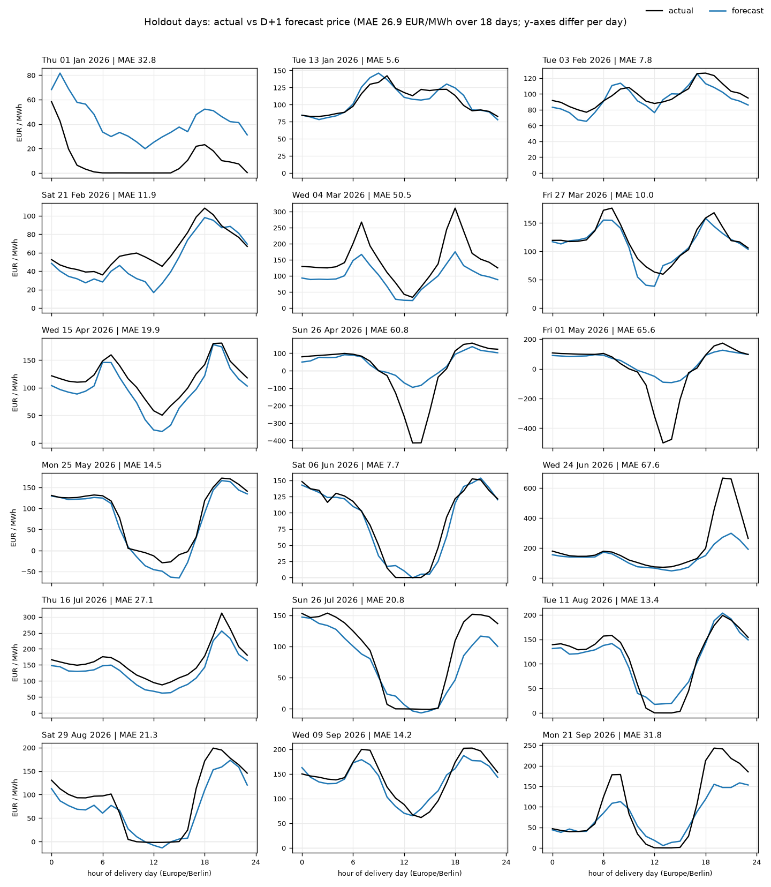
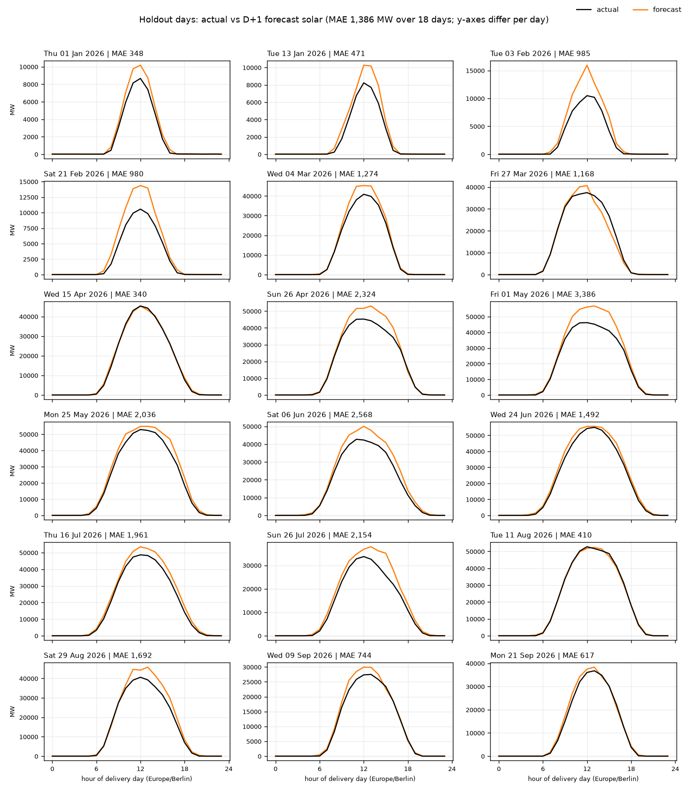
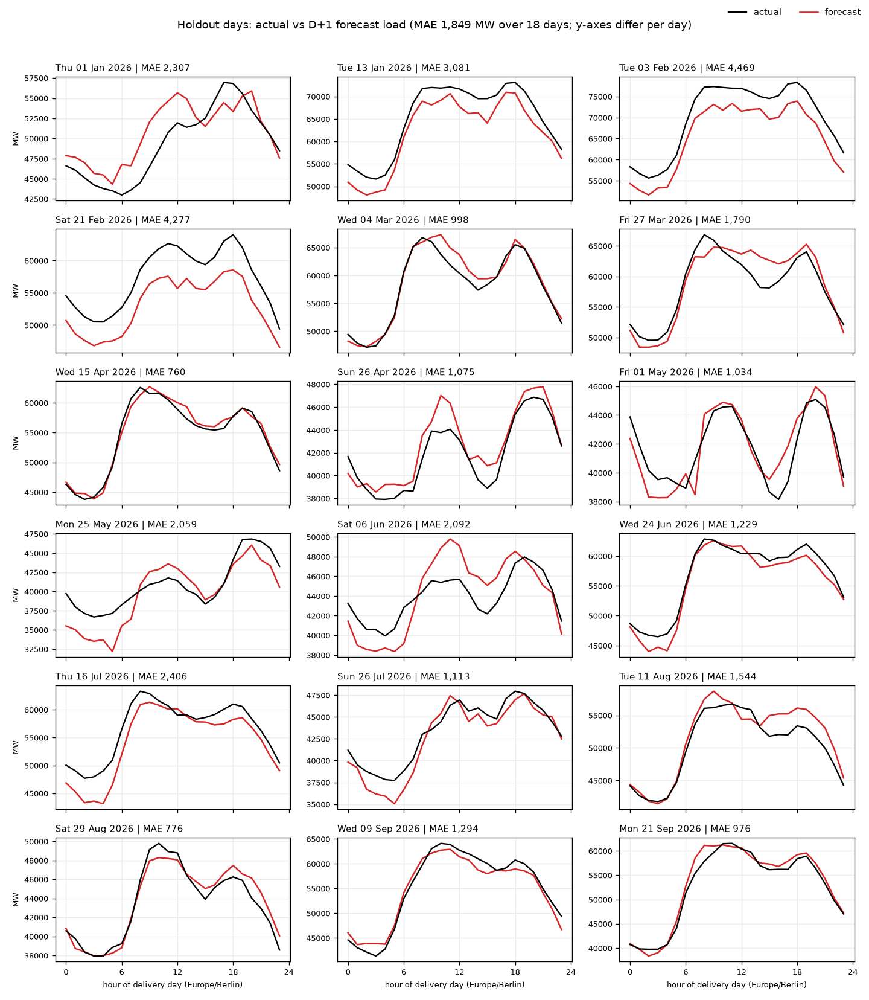

# Results explained

This page walks through the figures that show **how well the forecast works** and **what it bases
its predictions on**. It assumes no background in machine learning or electricity markets.

The project forecasts the German electricity price for each hour of the coming days. It does this in
two steps. First, three models forecast how much electricity German **wind** turbines and **solar**
panels will produce and how much electricity the country will use (the **load**). Then a fourth
model uses those three forecasts, together with weather and market information, to forecast the
**price**.

## A few terms first

| Term | Meaning |
|---|---|
| **Day-ahead price** | Electricity for each hour of tomorrow is traded in an auction today. Its result, in euros per megawatt-hour (**EUR/MWh**), is the price this project forecasts. |
| **MW / GW** | Megawatt / gigawatt: a rate of electricity production or use. 1 GW = 1,000 MW. Germany uses roughly 35-80 GW. |
| **Negative prices** | When far more power is produced than needed (typically sunny, windy holidays), producers can end up paying to deliver, and the price drops below zero. |
| **D+1** | The next delivery day: the day immediately after the forecast is made. |
| **MAE** | Mean absolute error: the average size of the forecast's miss, ignoring whether it was too high or too low. Lower is better. An MAE of 25 EUR/MWh means the forecast is off by 25 EUR/MWh in a typical hour. |
| **Holdout days** | 18 days from January to September 2026 that were kept aside and never used to tune or choose anything in the model. Scores on them are an honest test, like an exam the model never saw. |

## Part 1 - How good are the forecasts?

Each figure in this part shows the 18 holdout days, one small chart per day. For each day the model
was trained only on data from *before* that day, then asked to forecast it - just as it would be in
real use.

**How to read these charts.** The **black line** is what actually happened; the **coloured line** is
the forecast. The horizontal axis is the hour of the day (0 = midnight, 12 = noon, German time). The
title gives the date and that day's MAE. Each chart has **its own vertical scale**, because days
differ enormously: a calm winter day might vary by 60 EUR/MWh, a spring holiday by 600. So compare
the *shapes* between charts, not the heights.

### Price

Over the 18 days the price forecast is off by **26.86 EUR/MWh** in a typical hour.

- **The daily rhythm is usually right.** Prices are typically higher in the morning and evening,
  when people use more power, and lower around midday, when solar panels produce most. The forecast
  follows that pattern on most days, such as 13 January, 3 February, and 6 June.
- **Sharp evening spikes are underestimated.** On 4 March, 24 June, and 21 September the forecast
  rises at the right time but only about half as high as the real price.
- **Extreme negative prices are missed.** On Sunday 26 April and on the 1 May holiday, a flood of
  solar power pushed the price to -414 and -499 EUR/MWh. The forecast only dipped to about -90. In
  training, the most extreme 0.1% of prices at each end are deliberately capped so that a few freak
  hours do not distort the model, which also means it practically cannot reach such values.
- **Those three extreme days carry 40% of the total error.** Without them the MAE would be 19.29
  EUR/MWh. The sample also happens to contain more extreme days than a typical stretch of the year.
- **New Year's Day sits at the wrong level.** The real price stayed near zero most of the day; the
  forecast stayed 30-60 EUR/MWh higher.

### Wind generation

Typical miss: **1,804 MW**.

- **Rises and falls in wind are caught well**, including when a weather front arrives, as on 21
  February and 26 April.
- **The biggest misses are about the level on very windy winter days.** On 1 January and 3 February
  the forecast had the shape right but stayed several gigawatts too low.
- The wind forecast depends directly on the weather forecast, so when the weather forecast misjudges
  a storm's strength or timing, this forecast inherits the error.

### Solar generation

Typical miss: **1,386 MW**.

- **The shape of the solar day is always right** - zero at night, a smooth arc peaking around noon.
- **The midday peak is forecast too high on most days.** This is the clearest systematic error of
  the four models. Two causes fit the data. First, the amount of solar power produced per unit of
  sunlight has been falling year on year relative to the official installed capacity, so a model
  that learned from earlier years expects too much. Second, on days with negative prices, some solar
  parks switch off because producing would cost them money. That is why the gap is largest on the
  1 May holiday and large on Sunday 26 April, where the real curve is visibly flattened.
- On clear days without negative prices, such as 15 April and 11 August, the forecast is very close.

### Electricity use (load)

Typical miss: **1,849 MW**.

- **The daily pattern is captured well:** low at night, a steep rise in the morning, a working-day
  plateau, and an evening bump.
- **On winter working days the forecast is too low by 3-4.5 GW** (13 January, 3 and 21 February).
  The shape is right, so the model underestimates how much power Germany now uses on cold days.
  Possible reasons, not yet tested, include more electric heating than the model learned from.
- Weekends and holidays, when use is lower, are mostly reasonable. The largest weekend miss is
  Saturday 6 June, about 4 GW too high around midday.

## Part 2 - What does each model rely on?

### What a SHAP plot is

A forecasting model takes many inputs - wind speed at 20 places, the hour, the day of the week, and
so on - and turns them into one number. **SHAP** is a method that answers: *for this particular
hour, how much did each input push the forecast up or down?*

Think of it like splitting a restaurant bill. The model starts from an **average** forecast, the
*base value* (for the price model, 91.84 EUR/MWh). Each input then adds or subtracts its own share.
For one hour it might read: base 91.84, plus 30 because demand is high, minus 25 because it is
sunny, minus 10 because it is windy - giving a forecast of 86.84. The shares always add up exactly
to the forecast. Each share is that input's **SHAP value** for that hour, measured in the forecast's
own unit (EUR/MWh for price, MW for the others).

The figures below apply this to every hour of the past year (October 2025 to October 2026, about
8,760 hours), using the models exactly as they are used for real forecasts.

### How to read the two panels

Each figure has two panels.

**Left - "Feature families": which inputs matter most overall.** Related inputs are grouped: for
example, the wind speeds at all 20 weather points become one bar, "wind speed". The length of a bar
is the **average size of that group's push** across all hours, whether up or down. A longer bar
means the model leans on that group more. The number at the end of each bar is that average, in the
forecast's unit.

**Right - one dot per hour, for the most important individual inputs.** This view (a *beeswarm*)
shows not just *how much* each input matters, but *in which direction*:

- **Each row is one input**, sorted from most to least important.
- **Each dot is one hour.** Its horizontal position is that input's SHAP value in that hour: dots to
  the **right** of the grey centre line pushed the forecast **up**, dots to the **left** pushed it
  **down**. The further from the line, the bigger the push.
- **The colour is the input's own value** in that hour: **red = high**, **blue = low** (for example,
  red for strong wind, blue for calm).
- **Where many dots overlap, they pile up vertically**, so a thick part of a row shows where most
  hours sit.
- **"Sum of N other features"** (bottom row) adds together all the less important inputs.

**A worked example.** In the price figure, the row "wind_speed" has red dots on the left and blue
dots on the right. That reads: *strong wind (red) pushes the price forecast down; calm weather
(blue) pushes it up.* That matches reality - wind power is cheap, so when it is plentiful, prices
fall.

**Two cautions.** First, SHAP shows what the model has *learned to associate*, which is not always
the true cause; an example appears in the price figure below. Second, wide spreads in a row mean the
input's effect depends a lot on circumstances, not that the model is unsure.

### Price model

- **Electricity use (load) and sunshine matter most** - each moves the forecast by about 16-17
  EUR/MWh in a typical hour. High demand (red, "load" row) pushes the price up; strong sunshine
  (red, "irr_solar") pushes it down, by up to about 90 EUR/MWh on the sunniest hours.
- **Interestingly, the model reads sunshine directly** from the weather forecast more than from the
  solar model's output ("solar"). This is one reason the solar over-forecast in Part 1 does
  relatively little damage to the price forecast.
- **Wind behaves as expected:** more wind in Germany ("wind_speed", "wind") and in neighbouring
  countries ("nbr_wind_nl", "nbr_wind_fr", "nbr_wind_dk") lowers the price. More French nuclear
  power available ("nuclear_available_mw") lowers it too.
- **"price_lag_168h"** is the price at the same hour one week earlier: high prices last week push
  this week's forecast up. This input exists only for the first week of a forecast.
- **A misleading-looking example:** more import capacity from neighbouring countries
  ("ntc_imp_total", red) pushes the forecast *up*, although in reality more import capacity should
  lower prices. The likely explanation is timing: these capacities tend to be high in winter, when
  prices are high anyway, and the model has picked up that coincidence. This is the "association,
  not cause" caution above.

### Wind model

- **Wind speed is almost everything:** about 9,000 MW of push in a typical hour, against 500 MW for
  air temperature (cold air is denser and carries slightly more energy) and 400 MW for the calendar.
- **Every row has the same pattern - high wind (red) right, low wind (blue) left** - as it should.
  The rows "ws_de01", "ws_de02", ... are the wind speeds at individual weather points across Germany
  and its North and Baltic Sea areas; the model leans most on point 01.
- **The bottom row has a tail of red dots far to the left**: in the very strongest winds, the
  combined effect of the remaining points pushes the forecast *down*. This is consistent with
  turbines shutting down for safety in storms, which the model appears to have learned.

### Solar model

- **Sunlight reaching the ground (GHI) dominates**, at about 10,800 MW of push in a typical hour.
  The "irr_solar" row shows it clearly: bright hours (red) add up to about 27,000 MW; dark hours
  (blue) subtract about 6,000 MW from the average.
- **The sun's position** comes second, at about 600 MW. It now includes the compass direction of
  the sun ("solar_azimuth_cos"): most panels face south, so the same sun height gives more power
  around midday than in the morning or evening.
- **Direct normal irradiance** (sunshine measured facing the sun) adds about 500 MW. The calendar,
  cloud cover, and scattered (diffuse) light add only small refinements. Direct sunlight on flat
  ground is no longer an input: it is exactly GHI minus the scattered part, so it added nothing.

### Load model

- **The calendar dominates** (about 7,400 MW of push): people's routines drive electricity use more
  than the weather does.
- **"day_of_week"**: weekends (red, high values = Saturday and Sunday) lower use by 3,000-11,000 MW.
  **"is_holiday"**: public holidays lower it by 6,000-14,000 MW - the single largest effect.
- **"hour"**: night hours (blue) lower use by up to about 9,000 MW.
- **Temperature** adds about 1,700 MW. In the "t_de..." rows (temperatures at individual weather
  points), cold hours (blue) push use up - more heating.
- **"month_cos"** is a way of telling the model the season; its high values (red) mean winter, which
  raises use.

## What to take away

- **For the next day, the forecast captures the daily shape of prices well**, typically within about
  27 EUR/MWh, but it **underestimates sharp spikes and cannot reach extreme negative prices**.
- **Of the three supporting models, solar has the clearest systematic error** (too high at midday),
  linked to falling output per unit of sunlight and to solar parks switching off at negative prices.
  Load is too low on cold winter working days.
- **The models rely on sensible inputs in sensible directions:** demand and sunshine drive the
  price, wind speed drives wind output, sunlight drives solar, and routines drive demand.
- These results cover only the next day. Forecasts further ahead depend on less accurate weather
  forecasts and will be less accurate. See the [README](README.md#evaluation) for the remaining
  caveats.
